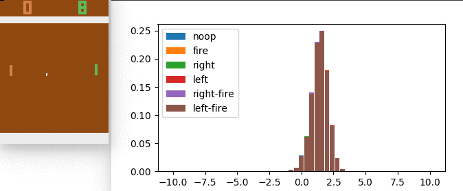
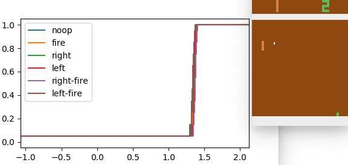

# Distributional DQN
Implementation of 'A Distributional Perspective on Reinforcement Learning' and
'Distributional Reinforcement Learning with Quantile Regression'
based on OpenAi DQN baseline.

#### C51:

#### Quantile Regression: (see branch quantile)

### Installation
Install the OpenAi fork https://github.com/Silvicek/baselines (parent changes a lot, compatibility isn't guaranteed)
Then install requirements

    pip3 install -r requirements.txt

### Usage:
For simple benchmarking:

    python3 train_[{cartpole, pong}].py
    python3 enjoy_[{cartpole, pong}].py

For full Atari options see help

    python3 train_atari.py --help

after learning, you can visualize the distributions by running

    python3 enjoy_atari.py --visual ...

-----------------

This implementation has been successfully tested on: Pong, Qbert, Seaquest

Some baseline features not supported (prioritized replay, double q-learning, dueling)
